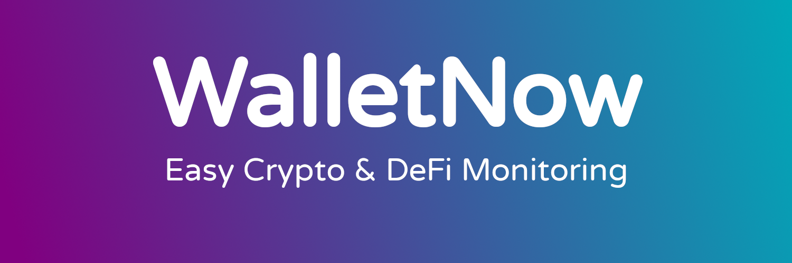

# WalletNow

**WalletNow** is an advanced crypto portfolio monitoring solution. It aggregates all your DeFi & CeFi investments in a searchable table and actively monitors it with an integrated Telegram Bot. With detailed LP information, impermanent loss and yields calculation, you are always in control of your wallet.

Check it out now for free on [walletnow.net](https://walletnow.net)

This is a brand new product, so we would love to hear your feedback! Please join our [Telegram Groups](stay-tuned.md) and share your experience.

### Our cool features

* [Telegram bot](features/telegram-bot.md): Check your portfolio status anywhere, any time
* [Active monitoring](features/active-monitoring.md) with alarms on your Telegram. Get notified if your investments suffers abnormal volatility. Configure your alarms thresholds
* View all your DeFi investments on Binance Smart Chain, including all BEP20 tokens and an [ever-growing list of protocols](supported-sources.md)!
* [Time Machine](features/time-machine.md): See how your investments were in the past. Complete including historical conversion rates.
* Add up to [five wallets](features/multiple-wallets.md) per account. See them all as part of the same account, along with aggregated totals.
* [Link with your Binance Exchange account](features/binance-exchange-integration.md) to see off-chain crypto investments combined, all in one place. _\(More exchanges coming soon\)_
* [Register customized](features/custom-vaults.md) crypto vaults investments from unsupported protocols.
* [Detailed views](features/detailed-token-data.md), including per-token details and currency conversions.

## Pricing

WalletNow is **free forever**. It will always have a free plan available for you to use - period!

To cover for the infrastructure and development costs we may offer paid plans in the future to unlock some of the most advanced features. **Right now, all features are 100% free to use, so go ahead and enjoy them.**

