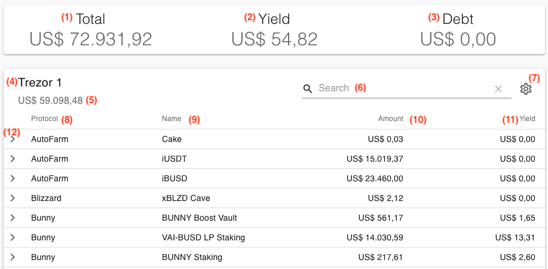

# Account view

Once you enter a wallet address, Wallet Now will process all the blockchain information for that wallet and display a summarized view of all investments in a table format.

On this page you will find the following information:

Each of the fields above is described here:

<table>
  <thead>
    <tr>
      <th style="text-align:left">Field #</th>
      <th style="text-align:left">Name</th>
      <th style="text-align:left">Description</th>
    </tr>
  </thead>
  <tbody>
    <tr>
      <td style="text-align:left"><b>(1)</b> 
      </td>
      <td style="text-align:left">Total account amount</td>
      <td style="text-align:left">
        
This is the consolidated &quot;<b>Net worth</b>&quot; of all your investments.

        
If you were to take out all investments now, this is roughly how much
          you would get.

      </td>
    </tr>
    <tr>
      <td style="text-align:left"><b>(2)</b>
      </td>
      <td style="text-align:left">Total account yield</td>
      <td style="text-align:left">
        
This is the consolidated <b>Yield Amount</b> of all your investments.

        
Notice that not all investments are able to calculate a yield.

      </td>
    </tr>
    <tr>
      <td style="text-align:left"><b>(3)</b>
      </td>
      <td style="text-align:left">Total account debt</td>
      <td style="text-align:left">This is the consolidated debt of all your investments.
         You have debt when you take loans from protocols such as Venus and Cream.</td>
    </tr>
    <tr>
      <td style="text-align:left"><b>(4)</b>
      </td>
      <td style="text-align:left">Wallet alias</td>
      <td style="text-align:left">
        
If you have configured an alias for your wallet, it will show here.

        
Otherwise, it will show a shortened version of your wallet address

      </td>
    </tr>
    <tr>
      <td style="text-align:left"><b>(5)</b>
      </td>
      <td style="text-align:left">Total wallet amount</td>
      <td style="text-align:left">Same as <b>(1)</b> but for this wallet only. If you have only one wallet,
        they will be the same.</td>
    </tr>
    <tr>
      <td style="text-align:left"><b>(6)</b>
      </td>
      <td style="text-align:left">Search</td>
      <td style="text-align:left">Here you can search and filter any field across all your investments</td>
    </tr>
    <tr>
      <td style="text-align:left"><b>(7)</b>
      </td>
      <td style="text-align:left">Select columns</td>
      <td style="text-align:left">Select which columns you want to see in the table</td>
    </tr>
    <tr>
      <td style="text-align:left"><b>(8)</b>
      </td>
      <td style="text-align:left">Protocol</td>
      <td style="text-align:left">
        
Name of the protocol hold that investment.

        
See <a href="../supported-sources.md">Supported sources</a> for a list of
          all protocols supported

      </td>
    </tr>
    <tr>
      <td style="text-align:left"><b>(9)</b>
      </td>
      <td style="text-align:left">Name</td>
      <td style="text-align:left">Name of the investment</td>
    </tr>
    <tr>
      <td style="text-align:left"><b>(10)</b>
      </td>
      <td style="text-align:left">Amount</td>
      <td style="text-align:left">
        
Amount of the investment. If you were to take out that investment now,
          this is roughly how much you would get.

        
Notice that some farms and pools have withdraw fees, which are not considered
          here

      </td>
    </tr>
    <tr>
      <td style="text-align:left"><b>(11)</b>
      </td>
      <td style="text-align:left">Yield</td>
      <td style="text-align:left">
        
This is how much that investment has generated in Yield so far.

        
Notice that not all investments are able to calculate a yield.

      </td>
    </tr>
    <tr>
      <td style="text-align:left"><b>(12)</b>
      </td>
      <td style="text-align:left">Expand details</td>
      <td style="text-align:left">Click on this icon to expand details of the investment</td>
    </tr>
  </tbody>
</table>

