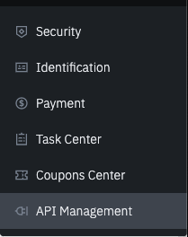
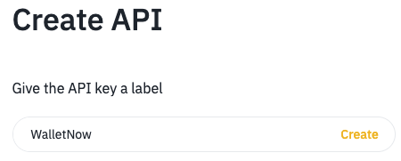

# Binance Exchange Integration

Would you like to see your off-chain investments consolidated along with your DeFi? You can do that for investments on the Binance Exchange!

The enable this feature you will need to follow these steps:

1.Login to your Binance account  
2. Navigate to "User Center" -&gt; "API Management"

3. Give a label to your key \(for example "WalletNow"\), and click on Create.

4. Enter your security verification codes  
5. Copy the "API Key" and "Secret Key" generated  
6. Optional: You can also edit the settings of the key to make it read only. By default, API Keys are created with "Spot & Margin Trading" permissions, which are not required by Wallet Now.  
7. Open Wallet Now and log-in to your account  
8. Open the "Account Settings", enable Binance Integration and enter the keys you copied  
9. Click on APPLY and return to your account data screen. All your Binance holdings \(including open orders\) will be included in the list now.

