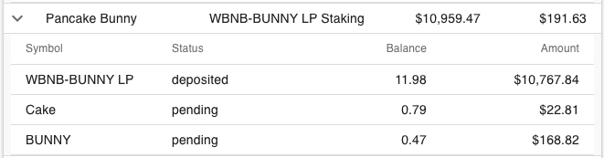

# Detailed token data

Wallet Now displays summarized information by default, containing only the most important data about your investments. However, sometimes we want to see all the details about what is part of that investment.

In the account data page, you can click on the small "arrow" on the left side of any investment to see additional details.

## Feature availability

| Free | Bronze | Silver | Gold |
| :--- | :--- | :--- | :--- |
| 🚫 | ✅ | ✅ | ✅ |

