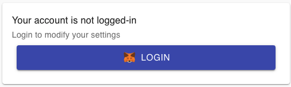

# Login

To modify any settings on your account, you will need to **Login** using your wallet.

The login process is very simple: We will request a message signature which you need to accept with your wallet application. This message signature happens completely offline, so **there is no cost for that**.

Once the message is successfully signed, we will store that information on your browser and use it to sign all the requests. This will enable you to modify your settings.

We currently support only MetaMask for the login process, but support for many more wallet applications is coming soon!

If you wish to logout for any reason, you can do so in the same page:

You can also configure your account to be visible only when logged-in. Read more about it [**here**](privacy-lock.md).

### Security considerations

Signing messages with your wallet \(even offline messages\) has been used as an attack vetor multiple times already, so it is important to understand WHAT is being signed.

WalletNow login messages are created using a combination of a server-side generated secret and the account address, and they look like this: `0uKt9xd7eor928EtFjTPI+oacQIPahMIBwoWQA+2j94=`

**Notice that the message will always end with an equals sign \(=\)**. This is a Base64-encoded message of a SHA256, and it will always have the exact length of 44 characters. Base64-encoded data cannot be used to perform any operations in the blockchain, so it is perfectly safe to sign this for the purposes of logins. **However, never sign messages which appear to be HEX-encoded** like this one: `bb4cdb9cbd36b01bd1cbaebf2de08d9173bc095c` as they may expose you to security threats.

