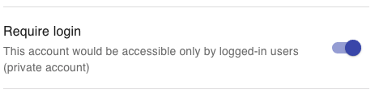

# Privacy Lock

We all know that data in the blockchain is public for anyone to read. Most of the time, if you share your public wallet address, anyone is able to see what is in there.

By default, this is also the case for Wallet Now: All you need is the address of an account to see all the investments on that account. This default behavior is very convenient since you can just bookmark a link to your account and check it anywhere: On your laptop, on your mobile, on any computer with internet access, etc.

However, we also understand that, even though all data is public, Wallet Now aggregates this data in a format that makes it super-easy to consume by anyway, and this may be a privacy concern. Also, Wallet Now can optionally aggregate data from off-chain sources, which are not public by default \(see [Binance Exchange  Integration](binance-exchange-integration.md)\).

To protect  your data even if someone gets hold of your wallet address, you can enable our privacy lock on Account Settings:

When you enable this feature, only the wallet owner is authorized to see the account data. You will need to login with your wallet, by signing a message \(at no cost - this signature happens offline\), which proves that you are the owner of that wallet.

